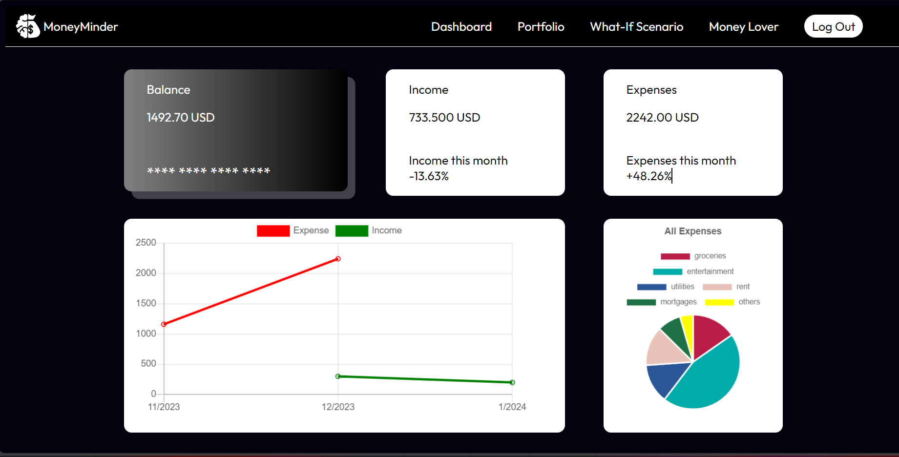
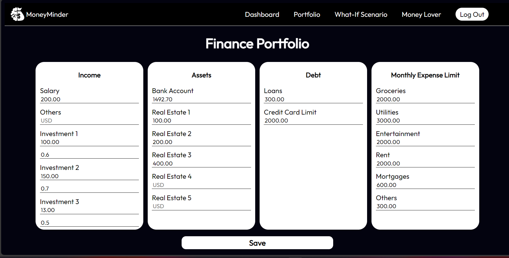
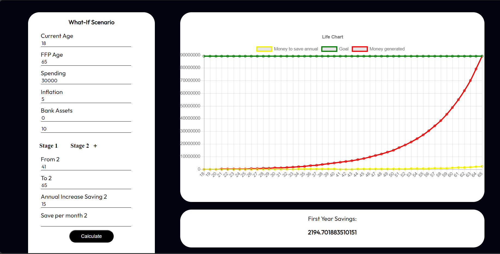
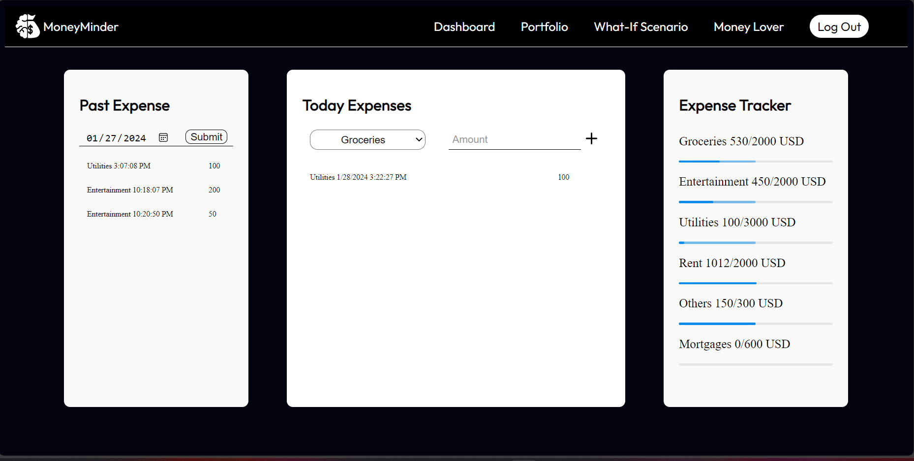

# Moneyminder App

## Overview

The Money Minder app, inspired by the article 'Financial freedom, final fantasy, ‘formative ageing,’ addresses the crucial need for effective personal finance management. Utilizing multiple regression analysis, it provides insights into spending behavior and financial projections. The app introduces 'formative ageing' and the innovative Financial Freedom Projection for retirement planning. With a focus on daily budget tracking, Financial Freedom Projection, and smart spending recommendations, the Money Minder app empowers users to shape their financial futures strategically.

## Table of Contents

- [Website](#website)
- [Technology Stack](#technology-stack)
- [Features](#features)
- [Resources and Inspirations](#resources-and-inspirations)
- [Contributors](#contributors)
- [License](#license)

## Website

Website link

## Technology Stack

The Money Minder app is built using the .NET framework, a robust and versatile technology stack. Leveraging the power of C# for backend logic, ASP.NET Core for web development, and ASP.NET Web API for RESTful APIs, the project embraces the efficiency and scalability offered by the .NET ecosystem

**Frontend:**

C# for backend logic

ASP.NET Core for web development

Razor syntax for server-side rendering

JavaScript (JS) for frontend interactivity

JSON for data interchange

Git for version control

**Backend:**

.NET Framework for server-side development

C# for backend logic

ASP.NET Web API for building RESTful APIs

PostgreSQL for data storage

**Database:**

PostgreSQL for data storage

**Authentication:**

JSON Web Tokens (JWT) for secure user authentication

**Deployment:**

Fly.io for deployment and hosting

## Features 

### 1. Dashboard

- **Overview**: A centralized hub providing a quick glance at essential financial data.

- **Account Summary**: Displaying balances, assets, debts, and the overall net worth.

- **Performance Metrics**: Monitoring the performance and growth of investments.

- **Customization**: Allowing users to tailor the dashboard by choosing preferred widgets.

- **Transaction Summary**: Showing recent financial transactions and summarizing income and expenses.

### 2. Portfolio Management:

- **Asset Allocation:** Visualizing the distribution of investments across various asset types.
- **Individual Holdings:** Offering details on each investment, including quantity, value, and historical performance.
- **Buy/Sell Transactions:** Enabling users to execute, monitor, and analyze buying or selling activities.
- **Performance Analysis:** Displaying historical returns and risk metrics for better decision-making.
- **Diversification Analysis:** Evaluating the level of diversification within the investment portfolio.

### 3. What-If Scenario:

- **Projection Tools:** Empowering users to create financial forecasts based on hypothetical scenarios.
- **Income Changes:** Modeling the potential impact of alterations in income levels.
- **Expense Changes:** Examining the consequences of modifying spending habits or major expenses.
- **Investment Returns:** Analyzing how different investment return rates may affect future wealth.
- **Retirement Planning:** Assessing various retirement scenarios and adjusting key variables.

### 4. Money Tracker / Expense Management:

- **Expense Tracking:** Allowing users to record and categorize daily expenditures.
- **Budgeting:** Setting budget limits for various categories and tracking actual spending against those limits.
- **Income Tracking:** Logging sources of income and monitoring overall cash flow.
- **Alerts and Notifications:** Notifying users when they approach or surpass budgetary limits.
- **Reports:** Generating reports and visual representations to better understand spending patterns.

## Resources and Inspirations

### **Inspirations**

- [Excel Demo](https://docs.google.com/spreadsheets/d/1Uxr0_q9n1ISodCaO8fyB4BpRL5pmjNHF4-bF7q3Yctg/edit?usp=sharing)

- [Financial Calculator Website](https://www.jagoinvestor.com/calculators)

- [How to Build a Bulletproof Financial Dashboard](https://www.kubera.com/blog/financial-dashboard)

### Articles

- [Linear Regression to Predict Customers’ Spendings](https://www.sciencedirect.com/science/article/pii/S1877042813046429)

- [Regression Analysis on Individual Financial Performance in Croatia](https://www.researchgate.net/publication/320848528_The_Regression_Analysis_of_Individual_Financial_Performance_Evidence_from_Croatia)

- [Project Cost Forecasting](https://www.sciencedirect.com/science/article/pii/S1877050921023024)

## Contributors
Nguyễn Hoàng Nam (Leader) 

Nguyễn Ngô Minh Trí (Back-end)

Tăng Thành Đạt (Front-end)

## License

This project is licensed under the terms of the [MIT License](https://opensource.org/license/mit/). 

